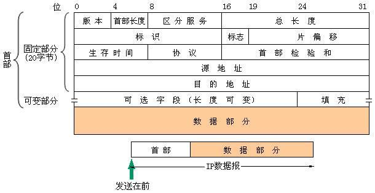

# 网络层

## 网络层提供的两种服务

网络层提供面向连接的`虚电路服务`和无连接的`数据报服务`。

##　网际协议IP

网际协议IP是TCP/IP体系中两个最主要的协议之一，是最重要的因特网标准协议之一。
与IP协议配套使用的还有三个协议
* 地址解析协议ARP
* 网际控制报文协议ICMP
* 网际组管理协议IGMP

将互联网连接起来需要使用一些**中间设备**，根据设备所在层次，中间设备可划分为四种
* 物理层：转发器
* 数据链路层：网桥/桥接器
* 网络层：路由器
* 网络层以上：网关

当中间设备是转发器或者网桥时，仅仅是将一个网络扩大，从网络层看，这仍然是一个网络

由于参加互联的计算机网络都使用相同的网际协议IP，因此可以将其看成一个虚拟互联网络，简称IP网。

互联网可以由多种异构网络互连组成。

## IP地址的分类

整个因特网是一个单一的、抽象的网络，IP地址就是给因特网上的每一个主机的每一个接口分配一个
在全世界范围内是唯一的32位标识符，由ICANN进行分配。

IP地址的编址方法经过了三个阶段
* 分类的Ip地址
* 子网的划分
* 构成超网

## 分类的IP地址

分类的IP地址是将IP地址划分为若干个固定类，每一类由两个固定的字段组成，第一个字段是`网络号`，它标志主机所连接到的网络；第二个参数是`主机号`，它标志该主机。一个IP地址在因特网内是唯一的。

* A类地址
  * 网络号为8位，高位第一位为0，范围是1~127
  * 主机号为24位，范围是1~1677_7214
  * 容纳网络127
* B类地址
  * 网络号为16位，高位前两位为10，范围是129~191
  * 主机号为16位，范围是1~65534
  * 容纳网络16383
* C类地址
  * 网络号为24位，高位前三位为110，范围是192~223
  * 主机号为8位，范围是1~254
  * 容纳网络209_7151

注：0.0.0.0代表本机；127.x.x.x代表环回测试

IP地址的特点
* IP由网络号和主机号组成。
  * 好处：IP管理机构只分配网络号；路由器仅根据网络号转发分组
* IP是标志一个主机和一个链路的接口
* 用转发器或网桥连接起来的若干局域网仍为一个网络
* 所有分配到网络号的网络都是平等的

## IP地址与硬件地址

* 物理地址是物理层和链路层使用的地址，而IP地址是网络层和以上各层使用的地址
* IP地址放在IP数据报的首部，硬件地址放在MAC帧的首部

在IP层抽象的互联网上只能看到IP数据报

路由器只根据目的站IP地址的网络号进行路由选择

在局域网的链路层只能看见MAc帧

只要在网络层讨论问题，就能够使用统一的、抽象的IP地址研究主机和主机或路由器之间的通信。

## 地址解析协议ARP

该协议的作用是根据IP地址找出相应的硬件地址

每个主机都有一个ARP cache，存放本局域网上的各主机和路由器的IP地址到硬件地址的映射表，每条映射都设置生存时间，超过生存时间的映射就从cache中删除。

当主机A向本局域网上的某个主机B发送IP数据报时，就先查询ARP cache中查询是否有主机B的IP地址
* 若存在，则取出B的IP地址对应的物理地址，将其写入MAC帧，然后通过局域网将该MAC帧发往该物理地址
* 若不存在，主机A自动运行ARP，在局域网广播发送一个ARP请求分组，当某主机的IP地址与该广播中的IP地址一致时就向主机A发送ARP响应分组，主机A收到后将物理地址写入ARP cache

## IP数据报的格式

* 版本
  * 占4位，指IP协议的版本
* 首部长度
  * 占4位，取值范围是5~15
* 区分服务
  * 占8位，用来获得更好的服务
* 总长度
  * 占16位，指首部和数据之和的长度
  * 当数据报长度超过数据链路层的MTU就必须进行分片处理
  * 在进行分片时，数据报首部中的总长度是指分段后的每一个分片的首部长度与该分片的数据长度的总和
* 标识
  * 占16位，相同的标识字段的值使得分片后的各数据报片最后能正确的重装为原来的数据报
* 标志
  * 占3位
  * 最低位记为MF，该位值为1表示后面还有分片
  * 中间位记为DF，该位值为0表示允许分片
* 片偏移
  * 占13位，片偏移以8个字节为单位
* 生存时间/TTL
  * 占8位，最大值为255。该位值每加一表示经过一个路由器，为零时丢弃该数据
* 首部检验和
  * 占16位

## IP层分组转发流程

* 从数据报的首部提取目的IP地址D，得出目的网络N
* 若Ｎ与路由器直连，则直接交付，否则执行下一步骤
* 若路由表中有目的地址为D的主机路由，则将数据报传递给下一跳路由器，否则执行下一步
* 若路由表中有到达网络N的路由，则将数据报传递给路由表中的下一跳路由器，否则执行下一步
* 若路由表有默认路由，则将数据报传递给默认路由，否则报告转发分组出错

## 划分子网

将物理网络划分为若干子网
> IP地址::={<网络号>,<子网号>,<主机号>}

使用子网掩码来区分划分子网与分类IP，将子网掩码与IP地址进行与运算即可得出正确的IP地址

划分子网后分组发送算法需要稍作改动

## 构成超网/CIDR

> IP地址::={<网络前缀>,<主机号>}

CIDR使用斜线记法，在IP地址后面加上斜线，然后写上网络前缀所占的位数，斜线后面的数字就是地址掩码中1的个数

## 网际控制报文协议ICMP

ICMP报文的种类有两种，即`ICMP差错报告报文`和`ICMP询问报文`

ICMP差错报文有五种
* 终点不可达
* 源点抑制
* 时间超过
* 参数问题
* 改变路由/重定向

ICMP询问报文有两种
* 回送请求和回答
* 时间戳请求和回答

**PING原理**

利用网络上机器IP地址的唯一性，给目标IP地址发送一个数据包，再要求对方返回一个同样大小的数据包来确定两台网络机器是否连接相通，时延是多少

** TraceRoute原理 **

当路由器收到一个IP包时，会修改IP包的TTL，检查这个 的TTL是否是0或1。如果是0，就丢弃这个包，并给主机发送ICMP通知，报告该包超时。

## 内部网关协议RIP

`RIP`是一种分布式的基于距离向量的路由选择协议

RIP协议要求网络中的每一个路由器都要维护从它到每一个目的网络的距离记录。从已路由器到直连的网络的距离定义为1，从一路由到非直连 的网络的距离为经过的路由器数加1，距离也称`跳数`。

** 距离向量算法 **
*  对地址为X的相邻路由器发送来的RIP报文，先将下一跳字段的地址都改为X，将所有距离加1。每一个项目都有三个关键数据：目的网络N、距离d、下一跳X
* 对修改后的每条记录，进行如下操作
  * 若原来的路由表中没有N，将该项目添加到路由表中，否则进行下一步
  * 若下一跳是X，将收到的项目替换原路由表中的项目。否则下一步
  * 若收到的项目中的d小于路由表中的距离则更新该项目，否则什么也不做
* 若3分钟还没有收到相邻路由器的更新路由表，则将相邻路由器的距离设为16
* 返回

## 路由器的构成

路由器划分为两部分：`路由选择`部分和`分组转发`部分

路由选择部分核心构件是路由选择处理机

分组转发部分由三部分组成：`交换结构`、一组`输入端口`、一组`输出端口`

交换结构又称交换组织，作用是根据转发表处理分组，将某个输入端口进入的分组从合适的输出端口转发出去

## VPN和NAT

`VPN`是利用公网的因特网作为本机构个专用网之间的通信载体。VPN内部使用因特网的专用地址。一个VPN至少要有一个路由器具有合法的IP。所有通过因特网传递的数据都要进行加密

使用`NAT`可以在专用网络内部使用专用IP地址，而仅在连接到因特网的路由器使用全球IP地址
