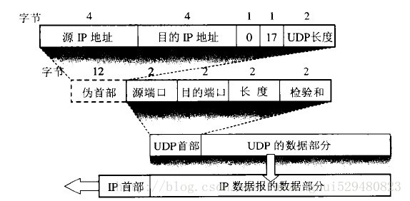
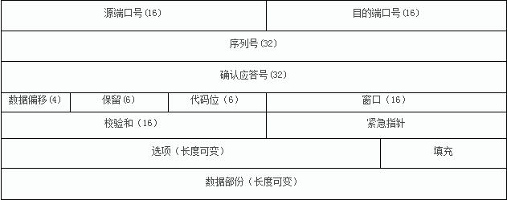

# 运输层

## 运输层协议概述

### 进程间的通信

运输层向上面的应用层提供通信服务，它属于通信部分的最高层，同时也是用户功能中的最低层

通信的真正端点并不是主机而是主机中的进程，`端对端通信`的应用进行之间的通信

网络层为主机之间提供逻辑通信，而运输层为应用进程之间提供端到端的逻辑通信

运输层还要对收到的报文进行`差错检测`

运输层有两种不同的运输协议，即`面向连接的TCP`和`无连接的UDP`

运输层向高层屏蔽了下面网络的核心细节，它使应用进程看见的就是好像在两个运输层实体之间有一条端对端的逻辑通信线路

### 运输层的两个主要协议

运输层的两个主要协议都是因特网的正式标准，即
* 用户数据报协议UDP
* 传输控制协议TCP

UDP在传送数据之前不需要先建立连接，远地主机的运输层在收到UDP报文后，不需要给出任何确认

TCP提供面向连接的服务，在传送数据之前必须先建立连接，数据传送结束后要释放连接

### 运输层的端口

运输层有`复用`和`分用`功能
* 应用层所有的应用进程都可以通过传输层再传送到IP层，这就是复用
* 运输层从IP层接收到数据后必须交付指明的应用进程，这就是分用

在运输层使用`协议端口号`，简称`端口`，端口用一个16位端口号来标志，端口号只具有本地意义，它只是为了标志本计算机应用层中的各个进程和运输层交互时的接口

端口号分为两大类
* 服务器端使用的端口号
  * 这里又分为两类：`熟知端口号`和`登记端口号`
  * 熟知端口号范围为1~1023，登记端口号范围为1024~49151
* 客户端使用的端口号
  * 范围为49151~65535

## UDP

UDP的特点
* 无连接
* 使用尽最大努力交付
* 面向报文
* 没有拥塞控制
* 支持一对一、一对多、多对一和多对多的交互通信
* 首部开销小，只有8字节

UDP首部格式

UDP有两个字段：`数据字段`和`首部字段`。首部字段各字段组成如下
* 源端口
  * 源端口号，在需要对方回信时选用，不用可设置为0
* 目的端口
  * 目的端口号，在终点交付报文时必须使用
* 长度
  * 用户数据报的长度，最小值是8，表示仅有首部
* 检验和
  * 检测数据在传输中是否有错，若有错则丢弃

## TCP

TCP特点
* 面向连接
* 每条TCP连接只能有两个端点
* 提供可靠交付的服务
* 提供全双工通信
* 面向字节流

TCP报文段首先要传送到IP层，加上IP首部后，再传送到数据链路层，再加上数据链路层的首部和尾部后才离开主机发送到物理网络

### TCP的连接

TCP把连接作为最基本的抽象。每条TCP连接都有两个端点，端点叫做`套接字`或`插口`。端口号拼接到IP地址即构成了套接字

> 套接字socket = (IP地址:端口号)

每一条TCP连接唯一地被通信两端的两个端点所确定
> TCP连接 ::= {socket1,socket2} = {(IP1:port1),(IP2:port2)}

## 可靠传输的工作原理

### 停止等待协议

### 连续ARQ协议

## TCP报文的首部格式

* 源端口和目的端口
  * 各占2字节，TCP的分用功能是通过端口实现的
* 序号
  * 占4字节
  * 指本报文所发送的数据的第一个字节的序号
* 确认号
  * 占4字节
  * 指期望对方下一个报文段的第一个数据字节的序号
* 数据偏移
  * 占4字节
  * 指TCP报文段的数据起始处与TCP报文段的起始处的距离，实际指TCP报文段的首部长度
* 保留
  * 占6字节
  * 目前不使用，设置为0
* 代码位
  * 共6字节，分为6部分
  * 紧急位URG：该位值为1表示紧急指针字段有效
  * 确认位ACK：ACK=1时确认位有效；连接建立后所有报文段ACK均为1
  * 推送PSH：实际很少使用
  * 复位RST：RST=1表示TCP连接中出现严重错误，必须释放连接
  * 同步SYN：SYN=1表示这是一个连接请求或连接接受报文
  * 终止FIN：FIN=1表示发送数据完毕，要求释放连接
* 窗口
  * 占2字节
  * 指发送本报文段一方的接收窗口
* 检验和
  * 占2字节
* 紧急指针
  * 占2字节
  * 指出本报文段中的紧急数据的字节数
* 选项
  * 可变，最长达40字节

## TCP可靠传输的实现

### 以字节为单位的滑动窗口

### 超时重传时间的选择

### 选择确认SACK

## TCP的流量控制

`流量控制`指让发送方的速率不要过快，要让接收方来得及接收

## TCP的拥塞控制

在某段时间内，若网络中某一资源的需求超过了该资源所能提供的可用部分，网络的性能就要变坏，这种情况叫`拥塞`

所谓的`拥塞控制`就是防止过多的数据注入到网络中，这样可以使网络中的路由器或链路不致过载。拥塞控制的前提是网络能够承受现有的网络负荷，它是一个全局性的过程

`流量控制`往往指点对点通信量的控制，是端到端的问题

几种拥塞控制方法
* 慢开始
* 拥塞避免
* 快重传
* 快恢复
